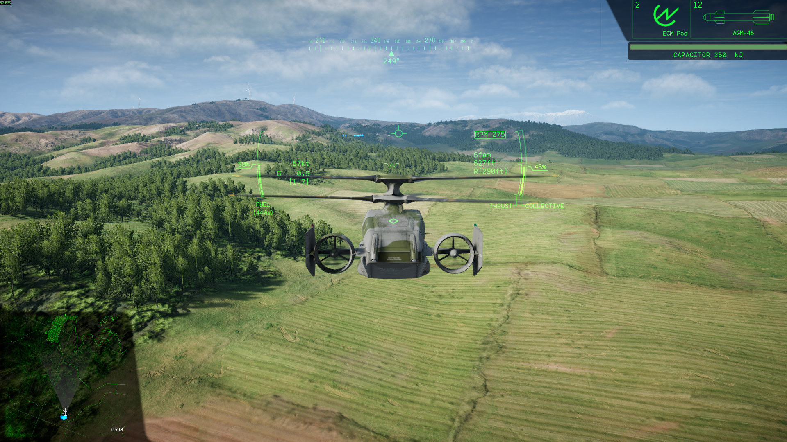

**I am just a hobbyist, not a professional programmer. I'll try my best to make this work well enough, but please set your expectations accordingly. Keep your fingers crossed and peepers peeled for a better mod to come along, or for the function to be added into the vanilla game. Happy flying o7**

# Orbit HUD for Nuclear Option

**A client-side mod that improves the Orbit camera experience in Nuclear Option.**

  

## About

This mod attempts to fix a common annoyance in **Orbit camera mode** (external view):
- The in-cockpit **HUD** is now properly visible while flying in Orbit camera.
- The **horizon line** and **pitch increment lines** are automatically hidden to reduce screen clutter and improve visibility.

Once installed, the mod is **enabled by default**. You can toggle it via the auto-generated config file.

## Features

- **HUD visibility in Orbit camera** — See your full situational awareness HUD (velocity vector, AoA, G-load, radar contacts, etc.) even when using external Orbit view.
- **Reduced clutter** — Horizon line + pitch ladder automatically disabled in Orbit mode for a cleaner screen.

**Important note about slewing / gimbaled guns in Orbit view**

This mod only adds the HUD to orbit camera.  
It does **not** change weapon aiming behaviour.

Gimbaled weapons & pilot-tracked guns (like helicopter guns) **do not aim where the camera is looking** in orbit view.  
They become very difficult / impractical to aim properly while using third-person/orbit camera.

## Requirements

- [Nuclear Option](https://store.steampowered.com/app/2168680/Nuclear_Option/) (Steam)
- [BepInEx](https://github.com/BepInEx/BepInEx/releases) (latest pack for Unity Mono games — usually drop the BepInEx folder into your game directory)

## Installation

1. Install **BepInEx** if you haven't already:
   - Download the appropriate pack from the [BepInEx GitHub releases](https://github.com/BepInEx/BepInEx/releases).
   - Extract it so `BepInEx` folder is directly inside your Nuclear Option install directory (e.g. `C:\Program Files (x86)\Steam\steamapps\common\Nuclear Option\`).
   - Launch the game once — BepInEx will generate its folders.

2. Download the latest release of this mod from the [Releases page](https://github.com/YourGitHubUsername/YourModName/releases).

3. Extract the contents of the zip file into the `BepInEx/plugins` folder.

## Disclaimer

> **Client-side mod.** Tested exclusively in **single-player** and on **private friend servers**.  
> 
> I am **not responsible** for kicks, bans, or any penalties on public servers.  
> **Always check each server's rules** before playing. Use online **at your own risk**.
